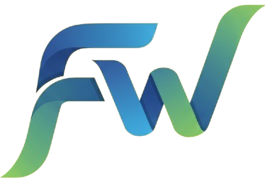

# FeedFlow MCP Server


[](https://github.com/astral-sh/uv)


FeedFlow is a `stdio`-based [FastMCP](https://github.com/mcp-client/fastmcp) server designed for managing and fetching articles from RSS feeds. It allows you to add, list, and read from multiple RSS feed sources directly through MCP tool calls, using a persistent SQLite database.

## Features

- **Add & Manage RSS Feeds**: Persistently add new RSS feeds to the database.
- **Categorize Feeds**: Assign a category and language to each feed for better organization.
- **List Feeds**: Retrieve a list of all stored feeds, or filter them by category.
- **Fetch Articles**: Get the latest articles from any given RSS feed URL, with summaries.
- **SQLite**: All feed data is stored in a local SQLite database.
- **Language Detection**: Automatically detects the language of a feed's content if not specified.
- **Asynchronous**: Built with `asyncio`, `aiosqlite`, and `httpx` for non-blocking I/O.

## Prerequisites

- Python 3.13+
- [uv](https://github.com/astral-sh/uv) (for installing dependencies from `uv.lock`)

## Installation

1.  **Clone the repository:**
    ```bash
    git clone <your-repository-url>
    cd FeedFlow
    ```

2.  **Install dependencies:**
    This project uses `uv` to manage dependencies. To install them, run:
    ```bash
    uv sync
    ```

## MCP Client configuration

Standard config:
```json
	"feedflow": {
		"command": "uv",
		"args": [
			"run",
			"--with",
			"fastmcp,feedparser,langdetect,httpx,aiosqlite",
			"Full path to FeedFlow\\app\\main.py"
		]
	}
```
| Client                 | DOC     |
| ---------------------- | ------- |
| Claude Desktop         | <a href="https://code.visualstudio.com/docs/copilot/customization/mcp-servers#_other-options-to-add-an-mcp-server">here</a>    |
| Copilolt / VS Code     | <a href="https://code.visualstudio.com/docs/copilot/customization/mcp-servers#_other-options-to-add-an-mcp-server">here</a>     |
| Cursor                 | Go to `Cursor Settings` -> `MCP` -> `New MCP Server`. Use the General config above.    |
| Gemini CLI             | <a href="https://github.com/google-gemini/gemini-cli/blob/main/docs/tools/mcp-server.md#how-to-set-up-your-mcp-server">here</a>    |
| Windsurf               | <a href="https://docs.windsurf.com/windsurf/cascade/mcp#mcp-config-json">here</a> |

## Available Tools & Resources

### Resources

- **`feeds://feeds`**: Returns a list of all configured RSS feeds.
- **`feeds://categories`**: Returns a list of all unique feed categories.
- **`feeds://feeds/{category}`**: Returns a list of RSS feeds filtered by a specific category.

### Prompts

- **`available_feeds_categories`**: Returns a list of all unique feed categories. 

### Tools

#### `add_custom_feed`
Adds a new RSS feed to the database.

- **Parameters:**
  - `url` (str, required): The URL of the RSS feed.
  - `name` (str, required): A descriptive name for the feed.
  - `category` (str, optional): The category for the feed (default: `General`).
  - `lang` (str, optional): The 2-letter ISO code for the language (default: `en`).

#### `remove_feed`
Removes a feed from the database.

- **Parameters:**
  - `feed` (str, required): The URL or the title/name of the feed to remove.

#### `list_feeds`
Returns the list of saved RSS feeds.

- **Parameters:**
  - `category` (str, optional): If provided, filters the feeds by this category.

#### `fetch_rss_feed`
Fetches and displays the latest articles from a given RSS feed URL.

- **Parameters:**
  - `url` (str, required): The URL of the RSS feed to fetch.
  - `max_results` (int, optional): The maximum number of articles to return (default: 5, max: 10).

## Test with modelcontextprotocol/inspector

from the project folder run:

```bash
npx @modelcontextprotocol/inspector uv run --with httpx --with aiosqlite --with fastmcp --with feedparser --with langdetect python app/main.py

```

## Running Tests

To run the test suite, use `pytest`:

```bash
pytest
```

with coverage

```bash
pytest --cov=. --cov-report=html
```

for coverage badge

```bash
pytest --cov=. --cov-report=html --local-badge-output-dir badges/
```

## License
This project is licensed under the MIT License. See the LICENSE file for details.

## Contributing
Contributions are welcome! Feel free to open issues or submit pull requests to improve the project.
